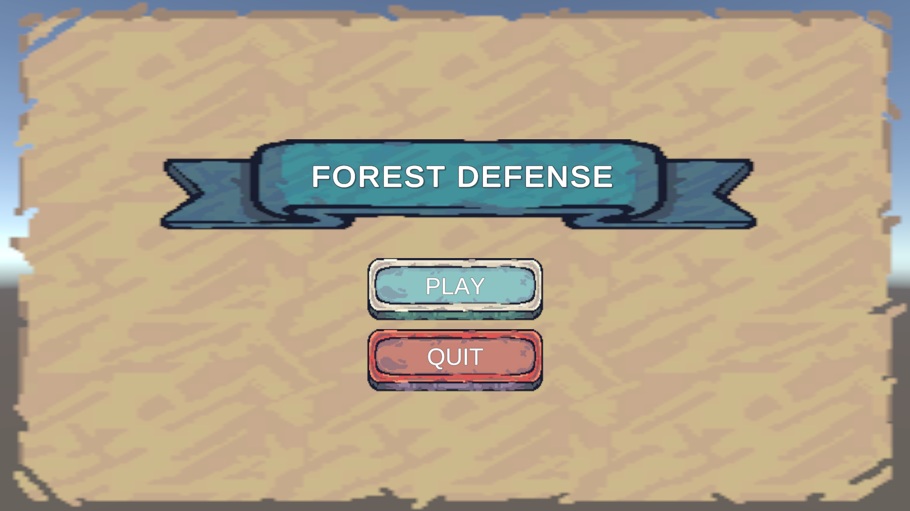
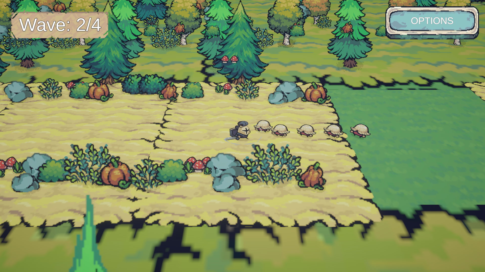
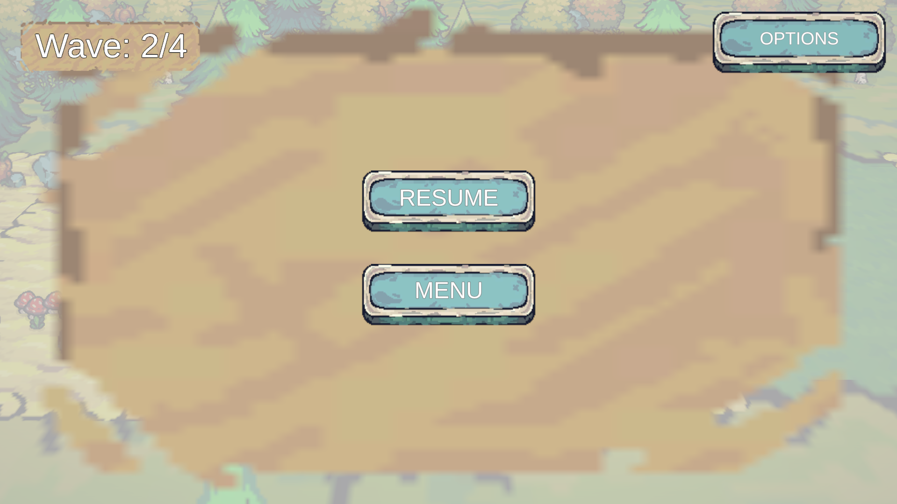
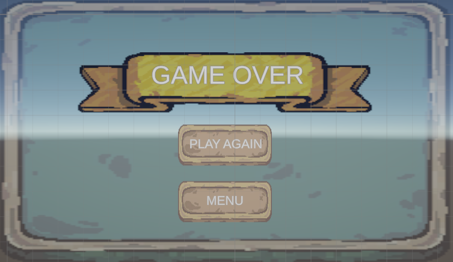

# 🌲 Forest Defense - Tower Defense Game

A **Tower Defense game** set in a mysterious **forest environment** where the player controls a warrior to defend against waves of enemies.  

This project was built with **Unity 2022.3.6f1 LTS** using **2D sprites in a 3D world** with a **45° perspective**, inspired by *Cult of the Lamb*.

---

## ✨ Features

### 🎮 Core Gameplay
- **Player Character**: Warrior with sword attacks  
- **Enemy Waves**: 4 waves of enemies with increasing difficulty  
- **Combat System**: Automatic sword attacks when enemies are in range  
- **Wave Indicator**: Shows wave progress during gameplay  

### 🖥️ User Interface
- **Main Menu**: Start and quit options  
- **In-Game Menu**: Pause menu with resume and quit options  
- **Game Over Screen**: Restart and main menu options  
- **Visual Feedback**: Wave progress bar/indicator  

### ⚙️ Technical Features
- **2D Sprites in 3D World**: Billboard rendering technique  
- **Camera System**: 45° perspective with smooth player tracking  
- **Enemy Pathfinding**: Waypoint-based movement system  
- **Wave Spawning**: Configurable timed waves  
- **Boundary System**: Prevents player/enemies from leaving the map  

---

## 📦 Prerequisites
To open and run this project, you need:
- **Unity 2022.3.6f1 LTS** (or later)  
- Basic understanding of the Unity Editor

---

## 📂 Installation & Run

To play the game without opening Unity:

- Go to the **Forest Defense Game** folder  
- Run **ForestDefense2.exe** to start playing the game  

If you want to explore or edit the project in Unity:

- Open the **ForestDefense2** folder inside Unity Editor  

---

## 🎮 Controls

### Main Menu
- **PLAY** → Start the game  
- **QUIT** → Exit the game  

### In-Game
- **WASD / Arrow Keys** → Move the warrior  
- **ESC** → Open pause menu  
- **OPTIONS** → Open pause menu  
- **RESUME** → Resume game from pause menu  
- **MENU** → Return to main menu  

### Game Over Screen
- **PLAY AGAIN** → Restart current level  
- **MENU** → Return to main menu  

---

## ⚔️ Game Mechanics

### 👤 Player Mechanics
- **Movement**: 2D movement in 3D space (WASD / arrows)  
- **Combat**: Automatic sword attacks when enemies are within range  
- **Invincibility Frames**: Short invulnerability after taking damage  

### 👹 Enemy Mechanics
- **Spawning**: Enemies spawn from the **right side of the map**  
- **Movement**: Follow predefined waypoints from right to left  
- **Health**: Each enemy has **30 HP**  
- **Destruction**: Enemies are destroyed upon reaching the end of the path  

### 🌊 Wave System
- **Progression**: 4 waves, each with more enemies  
- **Timing**: New waves start automatically  
- **Early Start**: Press **Space** to trigger the next wave early  
- **Boss Wave**: Special boss fight on the **4th wave**  

---

## 🛠 Technical Details

### Unity Configuration
- **Version**: Unity 2022.3.6f1 LTS  
- **Render Pipeline**: Built-in  
- **Camera Setup**: Perspective camera, 45° angle  
- **Physics**: Rigidbody-based movement (gravity disabled)  

---

## 📜 Key Scripts

### Player
- `PlayerMovement.cs` → Handles movement & animations  
- `PlayerAttack.cs` → Controls attack mechanics & timing  
- `PlayerHealth.cs` → Manages health and damage feedback  

### Enemies
- `EnemyMovement.cs` → Pathfinding & movement system  
- `EnemyHealth.cs` → Enemy HP & destruction logic  
- `EnemyStats.cs` → Configurable properties per enemy type  

### Systems
- `EnemySpawner.cs` → Wave system & enemy spawning  
- `CameraFollow.cs` → Smooth camera tracking with limits  
- `BoundaryManager.cs` → Prevents objects from leaving the map  
- `Billboard.cs` → Keeps sprites facing the camera  

### UI
- `MainMenuManager.cs` → Handles main menu logic  
- `InGameMenuManager.cs` → Pause menu functionality  
- `GameOverManager.cs` → Game over screen behavior  
- `WaveIndicator.cs` → Displays wave progress  

### Animation System
- **Player Animations**: Idle, Run, Attack  
- **Enemy Animations**: Idle, Run  
- **Animation Events**: Sync attack timing with damage events  

---

## 🖼️ Screenshots

### Main Menu

### Gameplay

### Pause Menu

### Game Over

---

## 👨‍💻 Credits

### Development
- **Game Design & Programming**: Emin DALKILIÇ  
- **UI/UX Design**: Emin DALKILIÇ  
- **Level Design**: Emin DALKILIÇ  

### Special Thanks
- **KFA Entertainment** → for providing the case study opportunity  

---

## 📜 License

This project was created **for educational purposes** as part of a **case study** for **KFA Entertainment**.  
All assets used are **placeholders** found on the web and selected specifically for this project.  

---

## 🚀 Notes
- This project demonstrates **tower defense mechanics** in a **forest theme**.  
- Intended as a **case study** project for showcasing technical and design skills.  
- Inspired by titles like **Cult of the Lamb** with a unique **2D-in-3D perspective**.  

---
